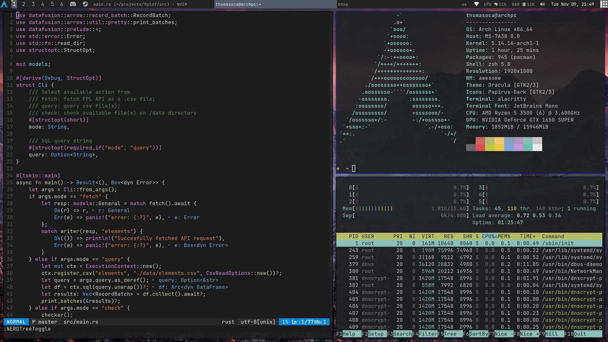

# thomasoca's dotfiles

My personal configuration for arch linux desktop.

## Setup used

- **Window manager**: [awesomewm](https://awesomewm.org/)
- **Shell**: [zsh](https://www.zsh.org/) with [oh-my-zsh](https://github.com/ohmyzsh/ohmyzsh)
- **Terminal**: [alacritty](https://github.com/alacritty/alacritty)
- **Application launcher**: [rofi](https://github.com/davatorium/rofi)
- **Compositor**: [picom](https://github.com/yshui/picom)
- **Text editor**: [neovim](https://github.com/neovim/neovim) with [coc.nvim](https://github.com/neoclide/coc.nvim) as LSP
